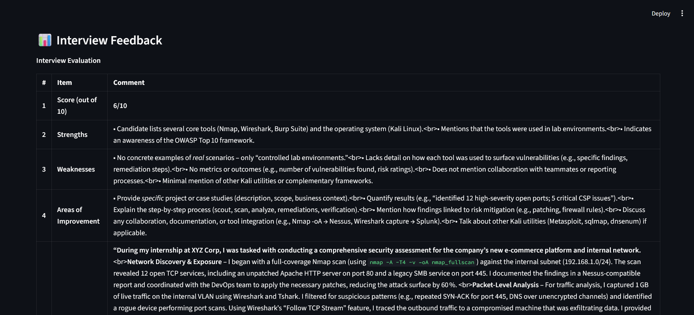

# 🚀 InterviewGPT - AI Powered Mock Interview Simulator

An AI-powered interview preparation platform that generates personalized interview questions from resumes and job descriptions, evaluates candidate answers, and provides detailed feedback.

## Features

✅ Resume Upload (PDF)

✅ Personalized Interview Questions

✅ HR Questions

✅ Technical Questions

✅ Behavioral Questions

✅ Project-Based Questions

✅ AI Answer Evaluation

✅ Interview Feedback

✅ Progress Tracking

## Tech Stack

- Python
- Streamlit
- OpenRouter API
- PyPDF2
- FPDF

## 📸 Project Screenshots

### 🏠 User Interface

The main dashboard where users upload their resume and enter the target job description.

---

### 📋 Personalized Interview Questions

AI-generated interview questions tailored according to the uploaded resume and target job role.

---

### 🎯 Mock Interview Mode

Interactive interview mode where users answer questions and receive AI-powered evaluation.

---

### 📊 AI Feedback & Evaluation

Detailed analysis of answers including score, strengths, weaknesses, areas of improvement, and suggested better responses.

---
  ## Architecture

PDF Resume
     ↓
Text Extraction
     ↓
OpenRouter AI
     ↓
Question Generation
     ↓
Mock Interview
     ↓
Answer Evaluation
     ↓
Feedback Report

## Project Workflow

Resume Upload
↓
Job Description
↓
Generate Questions
↓
Mock Interview
↓
Answer Evaluation
↓
Feedback Report

## Future Enhancements

- Voice-based interviews
- Real-time speech analysis
- Interview score dashboard
- Multi-language support
- ATS Resume Analysis integration
- Interview history tracking

## Installation

pip install -r requirements.txt

streamlit run app.py
Deploy on https://streamlit.io/cloud?utm_source=chatgpt.com

## Author

Vinayak Ojha

